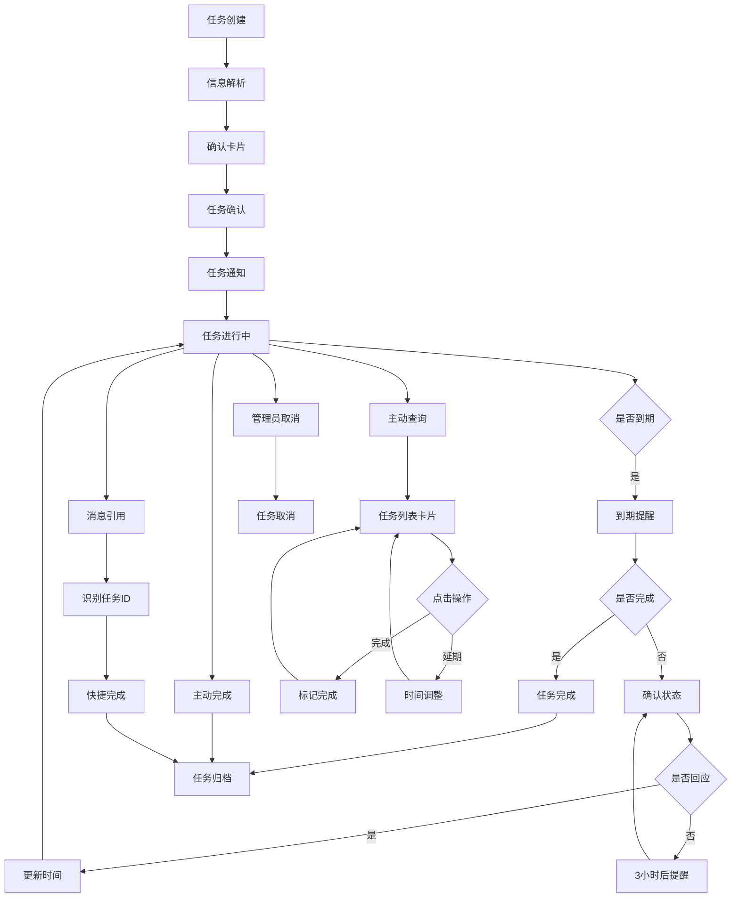

## 1. 产品概述
飞书任务追踪机器人是一个智能群聊助手，帮助管理者高效追踪团队成员的任务完成情况。通过自然语言交互，自动提取任务信息并进行智能提醒和统计。

解决团队任务管理混乱、跟进困难的问题，让管理者能够轻松掌握团队工作进度，提升协作效率。

## 2. 核心功能

### 2.1 用户角色
| 角色 | 注册方式 | 核心权限 |
|------|----------|----------|
| 管理员 | 飞书群管理员自动识别 | 创建任务、取消任务、查看所有任务统计 |
| 执行人 | 被@时自动识别 | 接收任务、标记完成、重新设置截止时间 |
| 普通成员 | 群聊成员 | 查看任务状态、接收通知 |

### 2.2 功能模块
核心功能包括：
1. **任务创建**：通过@机器人自动提取任务信息
2. **任务管理**：完成标记、取消、截止时间调整
3. **智能提醒**：多层级提醒机制
4. **周报统计**：自动生成周度任务报告

### 2.3 功能详情
| 功能模块 | 子功能 | 功能描述 |
|----------|--------|----------|
| 任务创建 | 智能解析 | 解析@消息中的任务名称、内容、执行人、截止时间 |
| 任务创建 | 信息确认 | 通过飞书卡片展示提取的任务信息供确认 |
| 任务管理 | 完成标记 | 执行人@机器人回复"已完成"标记任务完成 |
| 任务管理 | 任务取消 | 管理员@机器人回复"取消任务"撤销任务 |
| 任务管理 | 时间调整 | 执行人可重新设置任务截止时间 |
| 主动查询 | 任务列表 | 用户@机器人发送"我的任务"获取个人任务列表 |
| 主动查询 | 列表操作 | 任务卡片显示"✅ 标记完成"和"📅 延期"按钮 |
| 消息引用 | 快捷完成 | 回复历史任务消息输入"完成"自动识别任务ID |
| 智能提醒 | 截止提醒 | 任务到期前1天提醒执行人 |
| 智能提醒 | 完成确认 | 到期未完成任务询问执行人状态 |
| 智能提醒 | 二次提醒 | 无回应3小时后再次提醒 |
| 周报统计 | 自动报告 | 每周一10点生成上周任务完成情况统计 |

## 3. 核心流程

### 3.1 任务创建流程
管理员在群聊中@机器人并描述任务 → 机器人智能解析任务信息 → 发送确认卡片 → 管理员确认 → 任务创建成功 → 通知执行人

### 3.2 任务完成流程
**方式1**：执行人@机器人回复"已完成" → 机器人验证身份 → 更新任务状态 → 通知管理员 → 任务归档

**方式2（主动查询）**：执行人@机器人发送"我的任务" → 机器人返回个人任务列表卡片 → 点击"✅ 标记完成" → 更新任务状态 → 卡片刷新显示

**方式3（消息引用）**：执行人回复历史任务消息"完成" → 机器人识别任务ID → 验证身份 → 更新任务状态 → 原消息更新状态标识

### 3.3 提醒流程
系统检测即将到期任务 → 发送提醒给执行人 → 到期未回复 → 发送完成确认 → 3小时后无回应 → 二次提醒

### 3.4 周报流程
每周一10点触发 → 统计上周任务数据 → 生成完成率、未完成列表 → 发送到群聊

## 4. 交互设计

### 4.1 飞书卡片设计
- **任务确认卡片**：包含任务标题、内容、执行人、截止时间、确认按钮
- **任务提醒卡片**：显示任务概要、剩余时间、完成按钮、延期按钮
- **任务列表卡片**：个人所有未完成任务列表，每项任务附带"✅ 标记完成"和"📅 延期"按钮
- **周报卡片**：展示上周完成统计、各成员任务清单、完成率图表

### 4.2 消息交互
- 支持自然语言："@任务机器人 请张三明天完成产品文档"
- 主动查询："@任务机器人 我的任务"、"@任务机器人 未完成任务"
- 快捷指令："已完成"、"取消任务"、"延期到周五"
- 消息引用：回复历史消息"完成"自动识别对应任务
- 表情反馈：支持表情回复快速确认

### 4.3 通知策略
- 重要提醒@相关人员
- 周报@全体成员
- 避免过度打扰，同类任务合并提醒