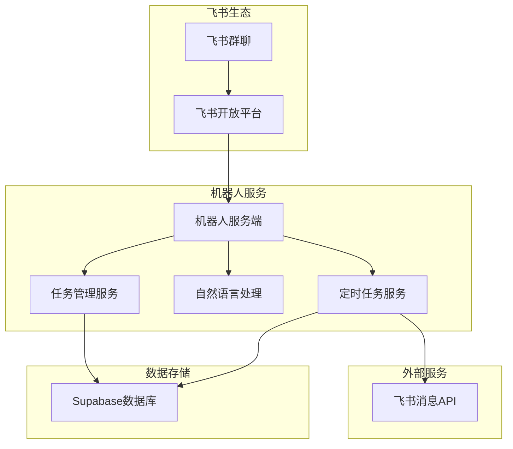
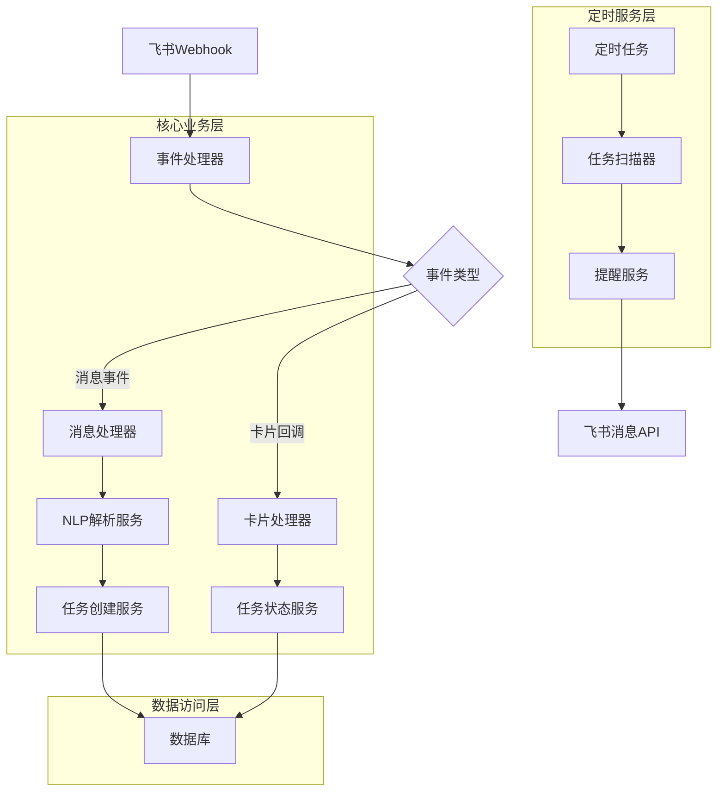
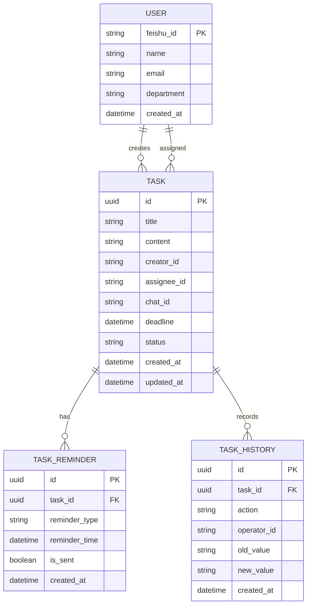

## 1. 架构设计



## 2. 技术描述

- **后端框架**: Node.js@18 + TypeScript + Express@4
- **数据库**: Supabase (PostgreSQL)
- **任务调度**: node-cron + bull队列
- **HTTP客户端**: axios
- **自然语言处理**: 飞书内置NLP API + 自定义关键词提取
- **部署平台**: 云函数/容器服务

## 3. 核心API定义

### 3.1 飞书事件回调
```
POST /api/feishu/webhook
```

请求参数:
| 参数名 | 类型 | 必需 | 描述 |
|--------|------|------|------|
| challenge | string | 否 | 验证签名 |
| token | string | 是 | 验证token |
| type | string | 是 | 事件类型 |
| event | object | 是 | 事件内容 |

响应格式:
```json
{
  "challenge": "response_challenge_string"
}
```

### 3.2 任务管理API
```
POST /api/tasks/create
```

请求参数:
| 参数名 | 类型 | 必需 | 描述 |
|--------|------|------|------|
| content | string | 是 | 任务内容 |
| assignee | string | 是 | 执行人飞书ID |
| deadline | string | 是 | 截止时间 |
| creator | string | 是 | 创建人飞书ID |
| chat_id | string | 是 | 群聊ID |

### 3.3 任务状态更新
```
PUT /api/tasks/:id/status
```

请求参数:
| 参数名 | 类型 | 必需 | 描述 |
|--------|------|------|------|
| status | string | 是 | 状态: pending/completed/cancelled |
| operator | string | 是 | 操作人飞书ID |

### 3.4 任务查询接口
```
GET /api/tasks/query
```

请求参数:
| 参数名 | 类型 | 必需 | 描述 |
|--------|------|------|------|
| user_id | string | 是 | 用户飞书ID |
| status | string | 否 | 任务状态筛选: pending/completed/cancelled |
| chat_id | string | 否 | 群聊ID，不传则查询所有群聊 |

响应格式:
```json
{
  "tasks": [
    {
      "id": "task_uuid",
      "title": "任务标题",
      "content": "任务内容",
      "deadline": "2024-01-01T10:00:00Z",
      "status": "pending",
      "created_at": "2023-12-25T10:00:00Z",
      "creator_name": "创建人姓名",
      "chat_name": "群聊名称"
    }
  ],
  "total": 5
}
```

### 3.5 消息上下文识别
```
POST /api/tasks/recognize-context
```

请求参数:
| 参数名 | 类型 | 必需 | 描述 |
|--------|------|------|------|
| message_id | string | 是 | 被回复的消息ID |
| reply_text | string | 是 | 回复内容 |
| user_id | string | 是 | 回复用户飞书ID |

响应格式:
```json
{
  "task_id": "识别的任务ID",
  "action": "complete/defer/cancel",
  "confidence": 0.95
}
```

## 4. 服务器架构



## 5. 数据模型

### 5.1 数据模型定义


### 5.2 数据定义语言

任务表 (tasks)
```sql
-- 创建任务表
CREATE TABLE tasks (
    id UUID PRIMARY KEY DEFAULT gen_random_uuid(),
    title VARCHAR(200) NOT NULL,
    content TEXT NOT NULL,
    creator_id VARCHAR(100) NOT NULL,
    assignee_id VARCHAR(100) NOT NULL,
    chat_id VARCHAR(100) NOT NULL,
    deadline TIMESTAMP WITH TIME ZONE NOT NULL,
    status VARCHAR(20) DEFAULT 'pending' CHECK (status IN ('pending', 'completed', 'cancelled')),
    created_at TIMESTAMP WITH TIME ZONE DEFAULT NOW(),
    updated_at TIMESTAMP WITH TIME ZONE DEFAULT NOW()
);

-- 创建索引
CREATE INDEX idx_tasks_creator_id ON tasks(creator_id);
CREATE INDEX idx_tasks_assignee_id ON tasks(assignee_id);
CREATE INDEX idx_tasks_chat_id ON tasks(chat_id);
CREATE INDEX idx_tasks_status ON tasks(status);
CREATE INDEX idx_tasks_deadline ON tasks(deadline);
```

任务提醒表 (task_reminders)
```sql
-- 创建提醒表
CREATE TABLE task_reminders (
    id UUID PRIMARY KEY DEFAULT gen_random_uuid(),
    task_id UUID REFERENCES tasks(id) ON DELETE CASCADE,
    reminder_type VARCHAR(50) NOT NULL,
    reminder_time TIMESTAMP WITH TIME ZONE NOT NULL,
    is_sent BOOLEAN DEFAULT FALSE,
    created_at TIMESTAMP WITH TIME ZONE DEFAULT NOW()
);

CREATE INDEX idx_reminders_task_id ON task_reminders(task_id);
CREATE INDEX idx_reminders_time ON task_reminders(reminder_time);
CREATE INDEX idx_reminders_sent ON task_reminders(is_sent);
```

任务历史表 (task_history)
```sql
-- 创建历史记录表
CREATE TABLE task_history (
    id UUID PRIMARY KEY DEFAULT gen_random_uuid(),
    task_id UUID REFERENCES tasks(id) ON DELETE CASCADE,
    action VARCHAR(50) NOT NULL,
    operator_id VARCHAR(100) NOT NULL,
    old_value TEXT,
    new_value TEXT,
    created_at TIMESTAMP WITH TIME ZONE DEFAULT NOW()
);

CREATE INDEX idx_history_task_id ON task_history(task_id);
CREATE INDEX idx_history_created ON task_history(created_at);
```

用户表 (users)
```sql
-- 创建用户表
CREATE TABLE users (
    feishu_id VARCHAR(100) PRIMARY KEY,
    name VARCHAR(100) NOT NULL,
    email VARCHAR(255),
    department VARCHAR(100),
    created_at TIMESTAMP WITH TIME ZONE DEFAULT NOW(),
    updated_at TIMESTAMP WITH TIME ZONE DEFAULT NOW()
);

CREATE INDEX idx_users_email ON users(email);
```

## 6. 权限配置

Supabase RLS策略配置：
```sql
-- 任务表权限
GRANT SELECT ON tasks TO anon;
GRANT ALL PRIVILEGES ON tasks TO authenticated;

-- 提醒表权限
GRANT SELECT ON task_reminders TO anon;
GRANT ALL PRIVILEGES ON task_reminders TO authenticated;

-- 历史表权限
GRANT SELECT ON task_history TO anon;
GRANT ALL PRIVILEGES ON task_history TO authenticated;

-- 用户表权限
GRANT SELECT ON users TO anon;
GRANT ALL PRIVILEGES ON users TO authenticated;
```

## 7. 部署配置

### 7.1 环境变量
```bash
# 飞书配置
FEISHU_APP_ID=your_app_id
FEISHU_APP_SECRET=your_app_secret
FEISHU_VERIFICATION_TOKEN=your_verification_token
FEISHU_ENCRYPT_KEY=your_encrypt_key

# 数据库配置
SUPABASE_URL=your_supabase_url
SUPABASE_ANON_KEY=your_anon_key
SUPABASE_SERVICE_KEY=your_service_key

# 服务配置
PORT=3000
NODE_ENV=production
```

### 7.2 定时任务配置
```javascript
// 每分钟扫描即将到期的任务
 cron.schedule('* * * * *', scanUpcomingTasks);

// 每天上午10点发送周报
 cron.schedule('0 10 * * 1', sendWeeklyReport);

// 每3小时检查未回应的提醒
 cron.schedule('0 */3 * * *', checkUnansweredReminders);
```