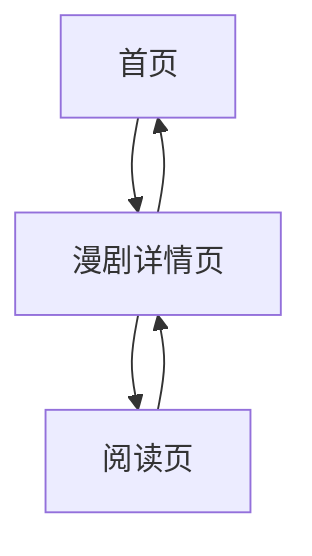

## 1. Product Overview
一个简洁美观的漫剧阅读应用MVP，提供基本的漫画浏览和阅读功能。用户可以轻松浏览漫画列表、查看详情并阅读章节内容。

目标用户为喜爱漫画阅读的普通用户，提供流畅的阅读体验。

## 2. Core Features

### 2.1 User Roles
本产品为单一用户角色，无需注册登录即可使用所有功能。

### 2.2 Feature Module
我们的漫剧App包含以下核心页面：
1. **首页**：展示漫剧列表，包含封面、标题和简介
2. **漫剧详情页**：展示漫剧详细信息、标签、更新状态和章节列表
3. **阅读页**：展示章节图片，支持上下滑动浏览和章节切换

### 2.3 Page Details
| Page Name | Module Name | Feature description |
|-----------|-------------|---------------------|
| 首页 | 漫剧列表 | 展示多个漫剧的封面图片、标题和一句话简介，点击可进入详情页 |
| 漫剧详情页 | 基本信息 | 展示漫剧封面、完整简介、标签分类和更新状态 |
| 漫剧详情页 | 章节列表 | 展示所有可用章节，点击可进入阅读 |
| 阅读页 | 图片展示 | 垂直滚动展示当前章节的所有图片 |
| 阅读页 | 章节导航 | 提供上一话/下一话按钮进行章节切换 |

## 3. Core Process
用户操作流程：
1. 用户进入首页，浏览漫剧列表
2. 点击感兴趣的漫剧，进入详情页查看信息
3. 在详情页选择章节，点击进入阅读页
4. 在阅读页通过上下滑动浏览图片，使用导航按钮切换章节

## 4. User Interface Design

### 4.1 Design Style
- 主色调：深蓝色 (#1e40af) 和白色
- 按钮样式：圆角矩形，悬停效果
- 字体：系统默认字体，标题18-24px，正文14-16px
- 布局风格：卡片式布局，网格展示
- 图标风格：简洁线性图标

### 4.2 Page Design Overview
| Page Name | Module Name | UI Elements |
|-----------|-------------|-------------|
| 首页 | 漫剧列表 | 响应式网格布局，每张卡片包含封面图(16:9)、标题(粗体18px)、简介(灰色14px)，卡片悬停有阴影效果 |
| 漫剧详情页 | 基本信息 | 顶部横幅展示封面，下方展示标题(24px粗体)、简介(16px)、标签(圆角标签)、更新状态(彩色标识) |
| 漫剧详情页 | 章节列表 | 垂直列表展示章节，每项包含章节号和标题，点击有视觉反馈 |
| 阅读页 | 图片展示 | 全屏垂直滚动，图片居中显示，保持原始比例 |
| 阅读页 | 章节导航 | 底部固定导航栏，包含上一话/下一话按钮，当前章节显示 |

### 4.3 Responsiveness
采用桌面端优先设计，适配移动端响应式布局。触摸设备优化滚动和点击交互。