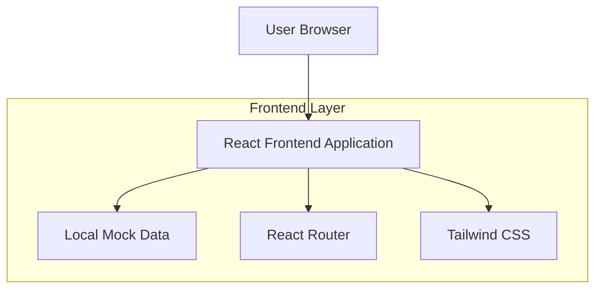

## 1. Architecture design



## 2. Technology Description

- Frontend: React@18 + tailwindcss@3 + vite
- Initialization Tool: vite-init
- Backend: None (使用本地假数据)
- 状态管理: React Hooks (useState, useEffect)
- 路由: React Router DOM v6

## 3. Route definitions

| Route | Purpose |
|-------|---------|
| / | 首页，展示漫剧列表 |
| /manga/:id | 漫剧详情页，展示漫剧信息和章节列表 |
| /read/:mangaId/:chapterId | 阅读页，展示章节图片 |

## 4. 项目结构

```
manga-app/
├── public/
│   └── images/          # 漫画封面和章节图片
├── src/
│   ├── components/      # 可复用组件
│   │   ├── MangaCard.jsx
│   │   ├── ChapterList.jsx
│   │   └── Reader.jsx
│   ├── pages/          # 页面组件
│   │   ├── Home.jsx
│   │   ├── MangaDetail.jsx
│   │   └── ReaderPage.jsx
│   ├── data/           # 本地假数据
│   │   └── mockData.js
│   ├── App.jsx
│   ├── main.jsx
│   └── index.css
├── package.json
└── vite.config.js
```

## 5. 数据模型

### 5.1 数据结构定义

```javascript
// 漫剧对象
interface Manga {
  id: string;
  title: string;
  cover: string;
  description: string;
  tags: string[];
  status: '连载中' | '已完结' | '暂停更新';
  chapters: Chapter[];
}

// 章节对象
interface Chapter {
  id: string;
  number: number;
  title: string;
  images: string[]; // 图片URL数组
}
```

### 5.2 本地假数据示例

```javascript
export const mockMangas = [
  {
    id: '1',
    title: '进击的巨人',
    cover: '/images/attack-on-titan-cover.jpg',
    description: '人类与巨人的生存之战，揭开世界的真相...',
    tags: ['动作', '悬疑', '黑暗奇幻'],
    status: '已完结',
    chapters: [
      {
        id: '1-1',
        number: 1,
        title: '致两千年后的你',
        images: ['/images/chapter1-1.jpg', '/images/chapter1-2.jpg']
      }
    ]
  }
  // ...更多漫剧数据
];
```