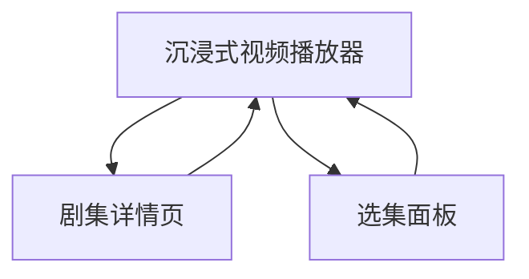

## 1. 产品概述
漫剧App是一个短视频剧集平台，采用竖屏全屏视频播放器的沉浸式体验设计。用户可以通过上下滑动切换剧集，享受类似抖音的流畅观看体验。

目标用户为喜欢短视频内容的年轻用户群体，解决传统长视频观看时间成本高的问题，提供碎片化娱乐内容。

## 2. 核心功能

### 2.1 用户角色
本应用为内容消费型产品，暂不需要用户注册登录即可观看内容。

### 2.2 功能模块
漫剧App包含以下核心页面：
1. **沉浸式视频播放器**：竖屏全屏视频播放，支持上下滑动切换剧集。
2. **剧集详情页**：展示剧集信息、简介和选集功能。

### 2.3 页面详情
| 页面名称 | 模块名称 | 功能描述 |
|-----------|-------------|-------------|
| 沉浸式视频播放器 | 竖屏全屏播放 | 默认竖屏全屏播放，支持触摸滑动上下切换剧集 |
| 沉浸式视频播放器 | 播放器控制 | 显示暂停/播放按钮、进度条、当前播放时间 |
| 沉浸式视频播放器 | 侧边控制栏 | 包含选集按钮、音量控制等基础功能 |
| 沉浸式视频播放器 | 滑动切换 | 向上滑动切换到下一集，向下滑动切换到上一集 |
| 剧集详情页 | 剧集信息 | 显示剧集标题、简介、标签信息 |
| 剧集详情页 | 选集列表 | 网格形式展示所有分集，支持快速跳转 |

## 3. 核心流程
用户操作流程：
1. 用户进入应用直接进入沉浸式视频播放器
2. 自动播放当前剧集，显示基础播放控制
3. 向上滑动切换到下一集，向下滑动返回上一集
4. 点击侧边选集按钮可查看所有集数并快速跳转
5. 点击剧集标题可进入详情页查看更多信息

## 4. 用户界面设计

### 4.1 设计风格
- 主色调：深色系背景（#000000）搭配亮色强调（#ff4757）
- 按钮样式：简洁的圆形按钮，半透明背景
- 字体：系统默认字体，标题16-18px，正文14px
- 布局风格：全屏沉浸式布局，最小化UI元素干扰
- 图标风格：使用简洁的线性图标，半透明设计

### 4.2 页面设计概览
| 页面名称 | 模块名称 | UI元素 |
|-----------|-------------|-------------|
| 沉浸式视频播放器 | 视频播放区域 | 竖屏全屏显示，默认9:16比例，支持双击暂停/播放 |
| 沉浸式视频播放器 | 播放控制栏 | 底部显示进度条、当前时间/总时长、播放/暂停按钮 |
| 沉浸式视频播放器 | 侧边控制栏 | 右侧显示选集按钮（底部位置），简洁图标设计 |
| 沉浸式视频播放器 | 滑动指示 | 顶部显示当前集数，切换时显示平滑过渡动画 |
| 剧集详情页 | 视频预览 | 顶部显示当前播放视频的缩略图 |
| 剧集详情页 | 剧集信息 | 显示标题（18px加粗）、简介（14px常规）、分类标签 |
| 剧集详情页 | 选集网格 | 4列网格布局，显示各集缩略图和集数 |

### 4.3 响应式设计
采用移动优先设计策略：
- 移动端：强制竖屏模式，全屏沉浸式体验
- 平板端：保持竖屏优先，可适当增加UI元素间距
- 桌面端：模拟竖屏体验，居中显示竖屏内容

### 4.4 交互设计
- 上下滑动：切换剧集（上滑下一集，下滑上一集）
- 单击屏幕：显示/隐藏播放控制栏
- 双击屏幕：暂停/播放切换
- 侧边按钮：点击显示选集面板
- 滑动反馈：平滑过渡动画，显示加载状态