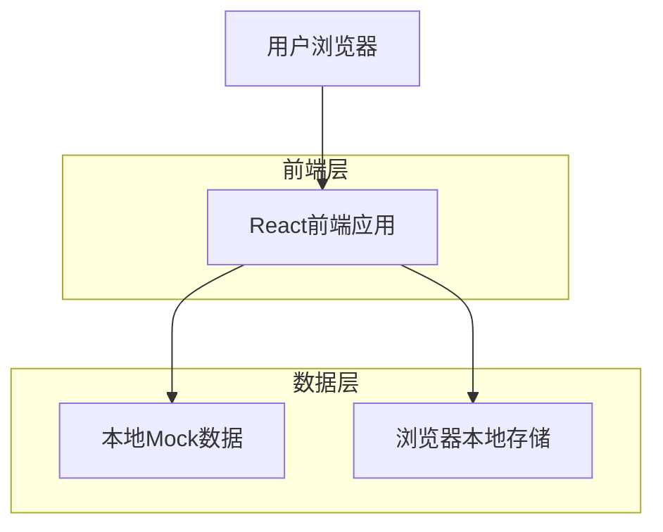
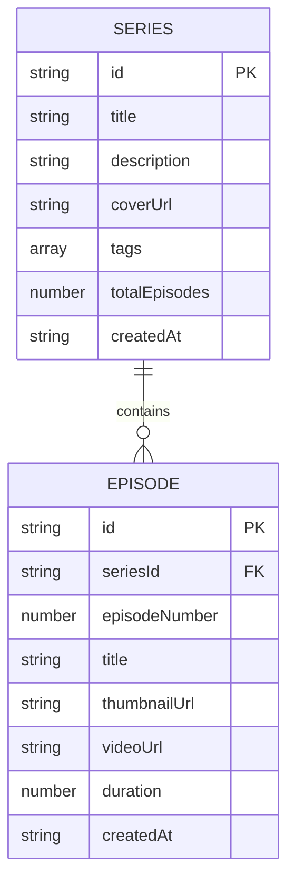

## 1. 架构设计



## 2. 技术描述

- 前端：React@18 + tailwindcss@3 + vite
- 初始化工具：vite-init
- 后端：无（使用本地Mock数据）
- 状态管理：React Context + useState
- 视频播放：HTML5 Video API + 自定义竖屏适配
- 触摸交互：Touch Event API 实现滑动切换
- 数据格式：竖屏视频占位符（9:16比例）

## 3. 路由定义

| 路由 | 用途 |
|-------|---------|
| /player | 沉浸式视频播放器，直接进入竖屏全屏播放模式 |
| /series/:id | 剧集详情页，展示剧集信息和选集功能 |

## 4. 数据模型

### 4.1 数据模型定义



### 4.2 本地Mock数据结构

Series（剧集系列）
```javascript
const mockSeries = [
  {
    id: "series_001",
    title: "都市爱情故事",
    description: "现代都市中的浪漫爱情故事，每集都是独立的情感片段",
    coverUrl: "/images/series1_cover_vertical.jpg", // 竖版封面图
    tags: ["爱情", "都市", "浪漫"],
    totalEpisodes: 50,
    createdAt: "2024-01-01"
  }
];
```

Episode（分集）
```javascript
const mockEpisodes = [
  {
    id: "ep_001_001",
    seriesId: "series_001",
    episodeNumber: 1,
    title: "初次相遇",
    thumbnailUrl: "/images/ep1_thumb_vertical.jpg", // 竖版缩略图
    videoUrl: "/videos/ep1_vertical.mp4", // 竖版视频（9:16比例）
    duration: 120,
    createdAt: "2024-01-01"
  }
];
```

## 5. 组件架构

### 5.1 核心组件
- `ImmersiveVideoPlayer`：沉浸式竖屏视频播放器组件
- `TouchSwipeHandler`：触摸滑动处理组件，支持上下滑动切换
- `VideoControls`：视频控制栏组件（半透明悬浮设计）
- `SideControlBar`：侧边控制栏组件（选集按钮等）
- `EpisodeSelector`：选集面板组件
- `SeriesDetail`：剧集详情页组件

### 5.2 状态管理
使用React Context管理全局状态：
- 当前播放的剧集和集数
- 播放历史记录
- 用户滑动操作状态
- 播放器UI显示状态（控制栏显隐）

### 5.3 本地存储
使用localStorage存储：
- 播放进度记录
- 用户观看历史
- 滑动操作偏好设置